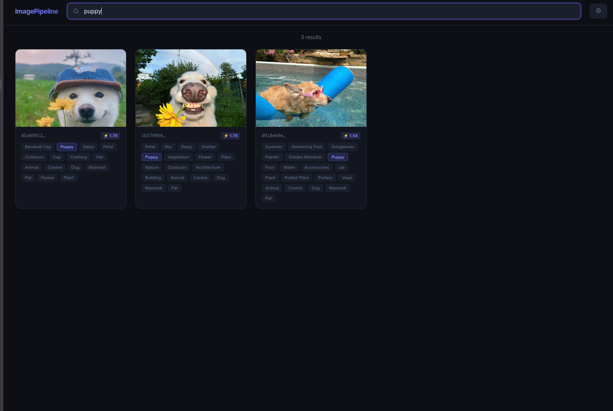

# ImagePipeline

ImagePipeline is a serverless image processing, moderation, and search pipeline built with AWS services, Go, and Pulumi. It automatically processes uploaded images, moderates content for safety, extracts descriptive labels, and enables real-time fuzzy text search via a web frontend backed by OpenSearch.

## System Architecture

### Image Processing Flow

```text
[ User ]        [ AWS S3 ]       [ AWS Lambda ]     [ AWS Rekognition ]    [ OpenSearch ]
   │                 │                  │                    │                   │
   │─── 1. Upload ──>│                  │                    │                   │
   │                 │─── 2. Trigger ──>│                  (Detect)              │
   │                 │    (s3:Created)  │                    │                   │
   │                 │                  │─── 3. Moderate ───>│                   │
   │                 │                  │<─── 4. Results ────│                   │
   │                 │                  │                    │                   │
   │                 │                  ├─── [ Explicit Content? ]               │
   │                 │                  │    ├── Yes: Delete from S3             │
   │                 │<─── 5. Delete ───│    └── No: Continue                    │
   │                 │                  │                    │                   │
   │                 │                  │─── 6. Label ──────>│                   │
   │                 │                  │<─── 7. Metadata ───│                   │
   │                 │                  │                    │                   │
   │                 │                  │─── 8. Index Metadata ─────────────────>│
   │                 │                  │                                        │
```

### Infrastructure Components

```text
                         +-------------------+
                         |   User / Browser  |
                         +---------+---------+
                                   |
                     +-------------+-------------+
                     | (fuzzy query / resources) |
                     v                           v
           +---------+---------+       +---------+---------+
           |    Web Frontend   |       |   AWS S3 Bucket   |
           |   (index.html)    |       | (uploads-bucket)  |
           +---------+---------+       +---------+---------+
                     |                           |
                     | (REST API)                | (s3:ObjectCreated)
                     v                           v
           +---------+---------+       +---------+---------+
           |    OpenSearch     |       | AWS Lambda (Go)   |
           |  (Docker on EC2)  |<------| (onCreateLambda)  |
           +-------------------+       +---------+---------+
                                                 |
                                                 | (analyze / moderate)
                                                 v
                                       +---------+---------+
                                       |  AWS Rekognition  |
                                       +-------------------+
```

## Infrastructure Details

The infrastructure is defined programmatically via Pulumi in Go and consists of the following components:

* **AWS S3 Bucket**: Serves as the raw upload destination. It allows public read access for displaying images in the web frontend and has event notifications configured to trigger the Lambda processor.
* **AWS Lambda Function**: A Go-based handler running on the `provided.al2023` runtime. It performs image parsing, coordinates moderation and feature extraction, and indexes results.
* **Amazon EC2 Instance**: A `t3.micro` instance running Amazon Linux 2023. It hosts a single-node OpenSearch deployment inside Docker, configured with custom CORS parameters for client-side search requests.
* **AWS IAM Roles & Policies**: Configured for least-privilege access, granting the Lambda permissions to read/delete from S3, perform AWS Rekognition operations, and write logs to CloudWatch.

## Key Features

* **Real-Time Automated Processing**: Triggered instantly upon S3 upload.
* **Automated Content Moderation**: Integrates with AWS Rekognition to detect explicit material. Offending images are deleted immediately from the S3 bucket.
* **In-Memory Format Conversion**: Automatically detects and converts non-JPEG image uploads (like PNG) to JPEG in-memory to ensure AWS Rekognition compatibility.
* **Full-Text Fuzzy Search**: Evaluates image labels, categories, and parent categories using OpenSearch. Supports prefix queries and fuzzy matching.
* **Dynamic Configuration**: The frontend (`index.html`) automatically updates with the correct S3 and OpenSearch endpoints using the `configure.sh` automation script, while also supporting runtime overrides via browser localStorage.

## Directory Structure

* `/lambda`: Source code and package dependencies for the Go processing Lambda.
* `/opensearch`: Pulumi configuration for provisioning the EC2 host and setting up Docker with OpenSearch.
* `/uploads`: Pulumi configuration for the S3 bucket, event notification triggers, and IAM policies.
* `/scripts`: Utility scripts, including configuration injection for the web UI.
* `/images`: Artifacts and screenshots for documentation.
* `main.go`: The entrypoint for Pulumi infrastructure deployment.
* `index.html`: The lightweight, client-side visual search interface.

## Getting Started

### Prerequisites

* Go 1.20 or later
* Pulumi CLI installed and authenticated
* AWS CLI installed and configured with appropriate credentials

### Deployment Steps

1. Deploy the infrastructure using Pulumi:
   ```bash
   pulumi up
   ```

2. Once the deployment finishes, update the web interface configuration with the live output values:
   ```bash
   ./scripts/configure.sh
   ```

3. Open `index.html` in a web browser to search for uploaded images.

## Media and Interface

### User Interface Screenshot


### Search Query Result
